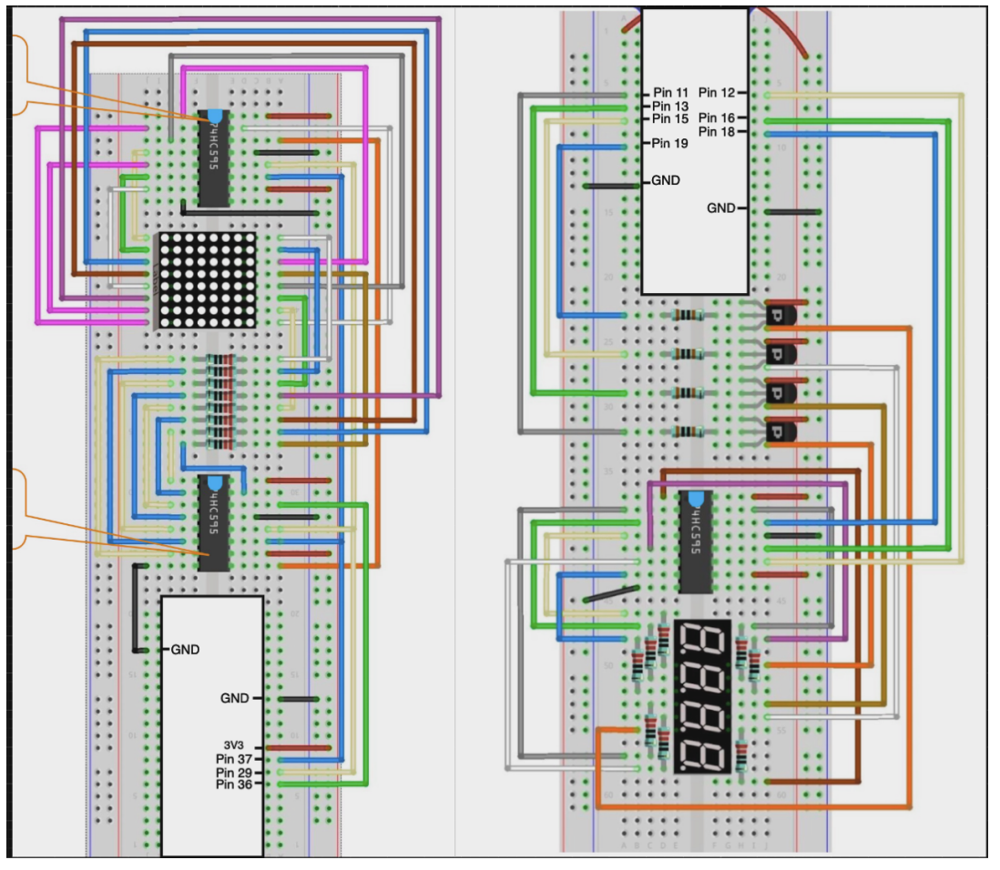
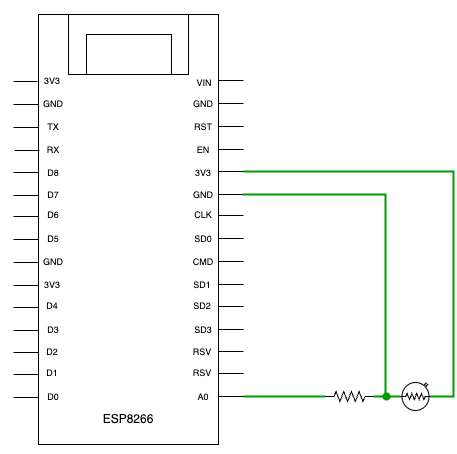

# Distributed Sensor Network

## Overview

This project focuses on creating an autonomous IoT network involving ESP8266 devices and a Raspberry Pi (RPi). The system allows ESP8266 devices to communicate via broadcast, sharing analog light sensor readings and designating a 'Master' device based on the highest sensor reading. Additionally, an LED ring is connected to each ESP8266 to visually represent the brightness level.

The RPi is integrated with an LED Matrix, providing a visual representation of the photocell data trace of the master device over the past ~30 seconds. Furthermore, a 4-digit 7-segment display is employed to show the last 3 digits of the IP address of the current Master.

To enhance user interaction, the system includes a Graphical User Interface (GUI) displaying the photocell data trace and a bar chart. Users can choose the specific log file for analysis, making the system more versatile and user-friendly.

[Watch Demo Video](https://drive.google.com/file/d/10y92JaCqSt_dLpVMYE58s7W4lGU6slHA/view?usp=sharing)

## Components

- Raspberry Pi
- ESP8266
- Photoresistor (Light Sensor)
- LEDs (Yellow)
- Button
- LED ring
- LED matrix
- 4-digit 7-segment display
- Shift register
- PNP transistor

## Repository Structure

- `network_monitor.py`: Contains the Raspberry Pi Python code responsible for monitoring and controlling the IoT network.
- `sensor_data_collector/sensor_data_collector.ino`: Contains the ESP8266 Arduino code responsible for collecting and broadcasting sensor data.
- `sensor_data_collector/WiFiCredentials.h`: Contains the WiFi SSID and password information for ESP8266.
- `node-red.json`: Source code of graphical user interface (GUI) using node-red.
- `logs/`: A folder that stores the log files created by Raspberry Pi.

## Functionality

The system's functionality operates according to the following steps:

1. **ESP8266 Light Sensor Broadcast**: 
   - Each ESP8266 device, equipped with an analog light sensor (photoresistor), broadcasts its readings when the network is silent for 200ms.
   - The ESP devices control the level of their LED ring to reflect the brightness of the sensor readings.

2. **Master Selection**:
   - The device with the highest reading becomes the "Master" and transmits data to the Raspberry Pi.
   - The Master ESP8266 lights up its onboard LED while non-Master ESP8266 devices do not activate this LED 

3. **Raspberry Pi Data Display and Reaction**: 
   - The Raspberry Pi displays the Master's data trace on its LED matrix.
   - Additionally, the Raspberry Pi displays the last 3 digits of the IP address of the current Master on a 4-digit 7-segment display.

4. **Raspberry Pi Reset and Button Connection**: 
   - A button connected to the Raspberry Pi triggers a system reset for all ESP8266 devices and activates its yellow LED for 3 seconds. A log file is created whenever the button is clicked.

5. **User Interface**:
   - A dropdown list shows all the log files created by Raspberry Pi.
   - Depending on the user's selection, the web server will dynamically display both the data trace curve and a corresponding bar chart.

5. **System Scalability**: 
   - The system dynamically accommodates 1-6 ESP8266 devices, showcasing functionality in progression from a single ESP8266 to the addition of multiple devices. Once the Raspberry Pi joins the network, the "Master" of the swarm continues to send network information.

### ESP8266 Functionality Chart ###

### Raspberry Pi Functionality Chart ###

### Raspberry Pi Flowchart ###

### ESP8266 Flowchart

## Schematic

### Raspberry Pi

### ESP8266

## Getting Started

1. Clone this repository to your local machine.
2. Upload the Raspberry Pi and ESP8266 code to their respective devices.
3. Build the circuit based on the provided schematics.
4. Replaced the WiFi SSID and password in WiFiCredentials.h and run the ESP8266 code.
5. Incorporate the ESP8266 devices into the system.
6. Set up Raspberry Pi to initialize the log server.
7. Host a web server using node-red. (Install `dashboard` and `node-red-contrib-fs` on the palette)

## Dependencies

- Python (for the Raspberry Pi)
- Arduino IDE (for the ESP8266)
- Node-red (for GUI)

## Acknowledgments

- This project was originally designed as a school project by Professor Quoc-Viet Dang.
