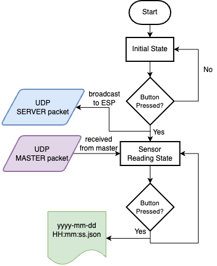

# Distributed Sensor Network

## Overview

This project focuses on creating an autonomous IoT network involving ESP8266 devices and a Raspberry Pi (RPi). The system allows ESP8266 devices to communicate via broadcast, sharing analog light sensor readings and designating a "Master" device based on the highest sensor reading. The RPi displays the Master's data and controls RGB LEDs corresponding to the ESP8266 devices, indicating sensor readings. Additionally, the system includes a reset functionality triggered by an RPi-connected button.

[Watch Demo Video](https://drive.google.com/file/d/1s9wrxynB38liuQjL5doZBcFQzliqNWak/view?usp=sharing)

## Components

- Raspberry Pi
- ESP8266
- Photoresistor (Light Sensor)
- LEDs (Red, Yellow, Green, and White)
- Button

## Repository Structure

- `network_monitor.py`: Contains the Raspberry Pi Python code responsible for monitoring and controlling the IoT network.
- `sensor_data_collector/sensor_data_collector.ino`: Contains the ESP8266 Arduino code responsible for collecting and broadcasting sensor data.
- `sensor_data_collector/WiFiCredentials.h`: Contains the WiFi SSID and password information for ESP8266.
- `state/`: Stores image assets for displaying device status in the Raspberry Pi's graphical user interface (GUI)

## Functionality

The system's functionality operates according to the following steps:

1. **ESP8266 Light Sensor Broadcast**: 
   - Each ESP8266 device, equipped with an analog light sensor (photoresistor), broadcasts its readings when the network is silent for 200ms.
   - The ESP devices flash one of their onboard LEDs to reflect the brightness of the sensor readings, with faster flashing indicating higher readings.

2. **Master Selection**:
   - The device with the highest reading becomes the "Master" and transmits data to the Raspberry Pi.
   - The Master ESP8266 lights up another onboard LED (distinct from the LED used for sensor brightness) while non-Master ESP8266 devices do not activate this second LED 

3. **Raspberry Pi Data Display and LED Reaction**: 
   - The Raspberry Pi displays the Master's data on its window screen.
   - Additionally, the Raspberry Pi flashes one of its three RGB LEDs, each corresponding to an ESP8266. The same LED flashes when the same ESP8266 becomes the "Master" at different times. The speed of flashing corresponds to the readings received by the Raspberry Pi

4. **Raspberry Pi Reset and Button Connection**: 
   - A button connected to the Raspberry Pi triggers a system reset for all ESP8266 devices and activates its White LED for 3 seconds.

5. **System Scalability**: 
   - The system dynamically accommodates 1-3 ESP8266 devices, showcasing functionality in progression from a single ESP8266 to the addition of multiple devices. Once the Raspberry Pi joins the network, the "Master" of the swarm continues to send network information.

### ESP8266 Functionality Chart ###

### Raspberry Pi Functionality Chart ###

### Raspberry Pi Flowchart ###

### ESP8266 Flowchart

## Schematic

## Getting Started

1. Clone this repository to your local machine.
2. Upload the Raspberry Pi and ESP8266 code to their respective devices.
3. Build the circuit based on the provided schematics.
4. Replaced the WiFi SSID and password in WiFiCredentials.h and run the ESP8266 code.
5. Incorporate the ESP8266 devices into the system.
6. Set up Raspberry Pi to initialize the log server.

## Dependencies

- Python (for the Raspberry Pi)
- Arduino IDE (for the ESP8266)

## Acknowledgments

- This project was originally designed as a school project by Professor Quoc-Viet Dang.
